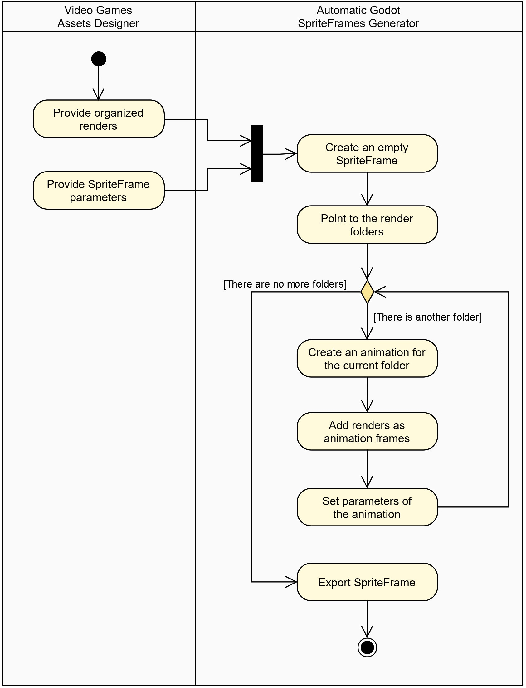

# Automatic Godot SpriteFrames Generator

A **Godot** tool to automate the entire process of creating **Godot SpriteFrames** resources with **Blender** renders as animation frames.

## Content
[1. Description](#1-description)  
[2. Requirements](#2-requirements)  
[3. Project Development](#3-project-development)  
&nbsp;&nbsp;&nbsp;&nbsp;[3.1. Summary](#31-summary)  
&nbsp;&nbsp;&nbsp;&nbsp;[3.2. Requirements Model](#32-requirements-model)  
&nbsp;&nbsp;&nbsp;&nbsp;[3.3. Analysis Model](#33-analysis-model)

## 1. Description

The tool is focused on easing the entire process of creating **Godot SpriteFrames** resources in **Godot**. To do this, it is considered that the process starts with rendering 3D models with **Blender**. Then the resulting renders can be optionally scaled to reduce their size. Later, all the renders are organized according to the parameters given by the user. Finally, the organized renders are used to create a complete **SpriteFrame** resource that is exported as a **.tres** file.

## 2. Requirements

The Automatic Godot SpriteFrames Generator needs a runnable version of **Blender**. Specifically, **Blender 3.2** version was used during the development process. Portable versions of Blender are admitted too. It is only necessary to provided the **Blender path** to execute its commands.

## 3. Project Development

### 3.1. Summary

A pseudo *Cascade Process* was used to implement the tool. For this reason, the obtained models during the process are presented below. In this context, the entire process has been made as a *practical exercise* of a traditional methodology.

### 3.2. Requirements Model

<!-- use case diagram -->

Four functional requirements were identified for the tool. The first one is related to the **scenes rendering process** done with Blender engine. The second one corresponds to the optional **process of scaling renders**. The third one is related to the **renders organizing process**, in which folders are created to organize renders by animation. Finally, the fourth one corresponds to the **process of creating SpriteFrames** resources by adding animations with renders as animation frames.

These requirements are included in the corresponding *Use Case Diagram*.

Use Case Diagram - Automatic Godot SpriteFrames Generator

<!-- activity diagrams -->

For each use case identified, the respective *Activity Diagram* was made, showing the normal flow of actions that are executed.

Activity Diagram - Render Blender Models

Activity Diagram - Scale Renders

Activity Diagram - Organize Renders

Activity Diagram - Create Godot SpriteFrame

### 3.3. Analysis Model

<!-- robustness diagram -->

To conceptualize the workflow of the Automatic Godot SpriteFrames Generator, a *Robustness Diagram* was made to show all the entities that collaborate in the realization of the functional requirements.

Robustness Diagram - Automatic Godot SpriteFrames Generator

The specific workflow used to satisfy each functional requirement is outlined in the created *Collaboration Diagrams*. It is important to mention that the diagrams show conceptual representations of the processes used to satisfy the requirements.

<!-- collaboration diagrams -->

Collaboration Diagram - Render Blender Models

Collaboration Diagram - Scale Renders

Collaboration Diagram - Organize Renders

Collaboration Diagram - Create Godot SpriteFrames

