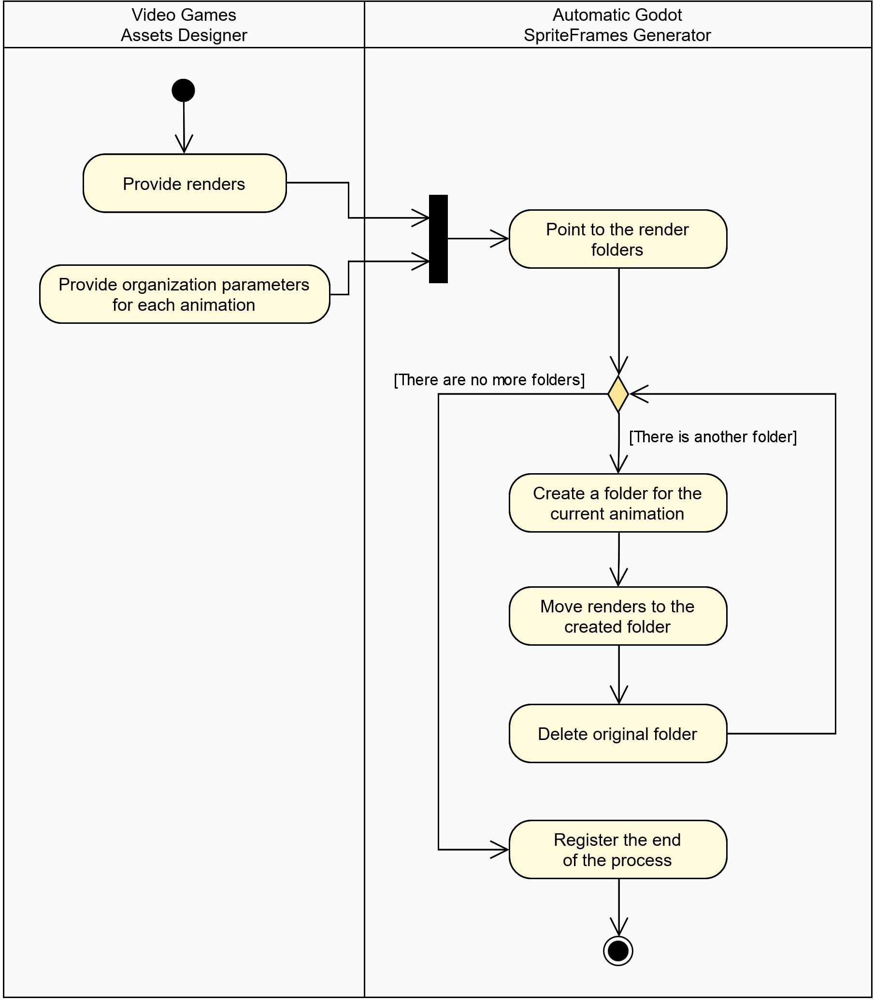
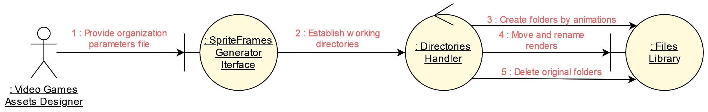

# Automatic Godot SpriteFrames Generator

A **Godot** tool to automate the entire process of creating **Godot SpriteFrames** resources with **Blender** renders as animation frames.

## Content
[1. Description](#1-description)  
[2. Requirements](#2-requirements)  
[3. Development Process](#3-development-process)  
&nbsp;&nbsp;&nbsp;&nbsp;[3.1. Summary](#31-summary)  
&nbsp;&nbsp;&nbsp;&nbsp;[3.2. Requirements Model](#32-requirements-model)  
&nbsp;&nbsp;&nbsp;&nbsp;[3.3. Analysis Model](#33-analysis-model)  
&nbsp;&nbsp;&nbsp;&nbsp;[3.4. Design Model](#34-design-model)  
&nbsp;&nbsp;&nbsp;&nbsp;[3.5. Test Model](#35-test-model)  

## 1. Description

The tool is focused on easing the entire process of creating **Godot SpriteFrames** resources in **Godot**. To do this, it is considered that the process starts with rendering 3D models with **Blender**. Then the resulting renders can be optionally scaled to reduce their size. Later, all the renders are organized according to the parameters given by the user. Finally, the organized renders are used to create a complete **SpriteFrame** resource that is exported as a **.tres** file.

## 2. Requirements

The Automatic Godot SpriteFrames Generator needs a runnable version of **Blender**. Specifically, **Blender 3.2** version was used during the development process. Portable versions of Blender are admitted too. It is only necessary to provided the **Blender path** to execute its commands.

## 3. Development Process

### 3.1. Summary

A pseudo *Unified Software Development Process* was used to implement the tool. For this reason, the obtained models during the process are presented below. In this context, the entire process has been made as a *practical exercise* of a traditional methodology.

### 3.2. Requirements Model

<!-- use case diagram -->

Four functional requirements were identified for the tool. The first one is related to the **scenes rendering process** done with Blender engine. The second one corresponds to the optional **process of scaling renders**. The third one is related to the **renders organizing process**, in which folders are created to organize renders by animation. Finally, the fourth one corresponds to the **process of creating SpriteFrames** resources by adding animations with renders as animation frames.

These requirements are included in the corresponding *Use Case Diagram*.

Use Case Diagram - Automatic Godot SpriteFrames Generator

<!-- activity diagrams -->

For each use case identified, the respective *Activity Diagram* was made, showing the normal flow of actions that are executed.

Activity Diagram - Render Blender Models

Activity Diagram - Scale Renders

Activity Diagram - Organize Renders

Activity Diagram - Create Godot SpriteFrames

### 3.3. Analysis Model

<!-- robustness diagram -->

To conceptualize the workflow of the Automatic Godot SpriteFrames Generator, a *Robustness Diagram* was made to show all the entities that collaborate in the realization of the functional requirements.

Robustness Diagram - Automatic Godot SpriteFrames Generator

The specific workflow used to satisfy each functional requirement is outlined in the created *Collaboration Diagrams*. It is important to mention that the diagrams show conceptual representations of the processes used to satisfy the requirements.

<!-- collaboration diagrams -->

Collaboration Diagram - Render Blender Models

Collaboration Diagram - Scale Renders

Collaboration Diagram - Organize Renders

Collaboration Diagram - Create Godot SpriteFrames

### 3.4. Design Model

<!-- class diagram -->

The design of the tool was done at a very high level of abstraction because Godot does not work directly with classes. For this reason, the *Class Diagram* shows the core of the code, relating nodes with classes and methods with functions respectively.

The proposed architecture is based on the use of a central controller that manages all the communications between nodes. In a certain way, an *MVC Architecture* has been implemented, since the visual part and the logical part will be managed from different nodes or classes.

Class Diagram - Automatic Godot SpriteFrames Generator

Additionally, the *Sequence Diagram* showing the communications between classes has been omitted, since signals and function calls are used in a different way in Godot.

### 3.5. Test Model

To preserve traceability each *Use Case* has a *Test Case* that shows the normal flow of actions and results obtained with the tool.

<!-- test case - render blender models -->

Test Case - Render Blender Models

#### Description

This *Test Case* describes the inputs received by the tool, the results expected by the user and the relevant conditions used to verify the normal flow of actions for the *Use Case - Render Blender Models*. 

#### Inputs

- The user specifies the path of the Blender engine resources.
- The user specifies the working directories, including the path of the Blender file and the root folder in which renders will be saved. 
- The user specifies all the render parameters that will be used by the tool for rendering the scenes, including the rendering engine, the name of the scenes in the Blender file and the end and start frames of the scenes.

#### Results

- The tool executes a command that will start the rendering process using the Blender engine resources.
- The Blender engine renders each scene and saves the renders in a new folder named as the corresponding scene.

#### Conditions

- The rendering process will not start if the root folder is not empty.
- The rendering process will not start if the path of the Blender engine resources is not correct. 

<!-- test case - scale renders -->

Test Case - Scale Renders

#### Description

This *Test Case* describes the inputs received by the tool, the results expected by the user and the relevant conditions used to verify the normal flow of actions for the *Use Case - Scale Renders*. 

#### Inputs

- The user specifies the working directories, including the source path of the renders to be scaled and the destination path where the scaled renders will be saved. 
- The user specifies the dimensions that will be used to scale the renders.

#### Results

- The tool clones the structure of the folders in the source path and creates folders with the same name in the destination path.
- The tool scales the renders of the source path and saves the results in the destination path.

#### Conditions

-  The scaling process will not start if the destination path is not empty.

<!-- test case - organize renders -->

Test Case - Organize Renders

#### Description

This *Test Case* describes the inputs received by the tool, the results expected by the user and the relevant conditions used to verify the normal flow of actions for the *Use Case - Organize Renders*. 

#### Inputs

- The user provides and CSV file with the organization model that will be used to create new folders and move renders.
- The user specifies the source path of the renders where the renders will be organized.

#### Results

- The tool creates a folder for each individual animation in the source path.
- The tool moves the renders from the source path to the new created folders. 
- The tool removes the original folders from the source path.

#### Conditions

- The CSV file should contain at least three columns. The first one corresponds to the internal source path of the renders that will be organized in a single animation. The second one indicates the start frame of the animation. The third one indicates the last frame of the animation.

<!-- test case - create godot spriteframes -->

Test Case - Create Godot SpriteFrames

#### Description

This *Test Case* describes the inputs received by the tool, the results expected by the user and the relevant conditions used to verify the normal flow of actions for the *Use Case - Create Godot SpriteFrames*. 

#### Inputs

- The user specifies the parameters of the SpriteFrame, including its name and the FPS of the animations.
- The user specifies the working directories, including the source path of the renders that will be used to create the SpriteFrame and the destination path where the exported SpriteFrame will be saved.

#### Results

- The tool creates an empty SpriteFrame with the given name.
- The tool adds animations in the SpriteFrame using renders as animation frames.
- The tool sets the FPS of the animations.
- The tool exports the SpriteFrame in the destination path.

#### Conditions

- The source path should contain renders in a logical and organized way.

